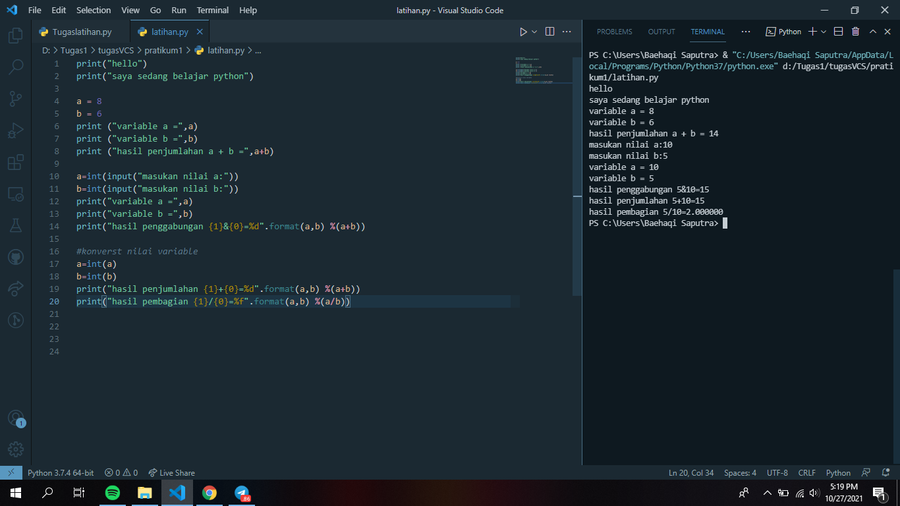
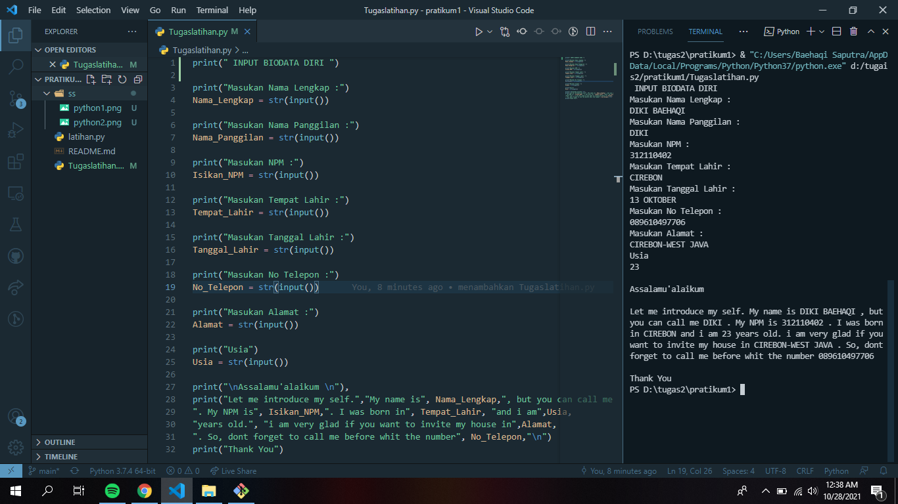

# pratikum1

## Belajar Pemrograman python

### latihan membuat program variable
ini adalah hasil program yang telah dibuat dan hasil eksekusi/RUN

### Membuat Tugas latihan Input Biodata Diri
ini program untuk menginputkan biodata diri secara lengkap dan hasil eksekusi/RUN

TERIMAKASIH